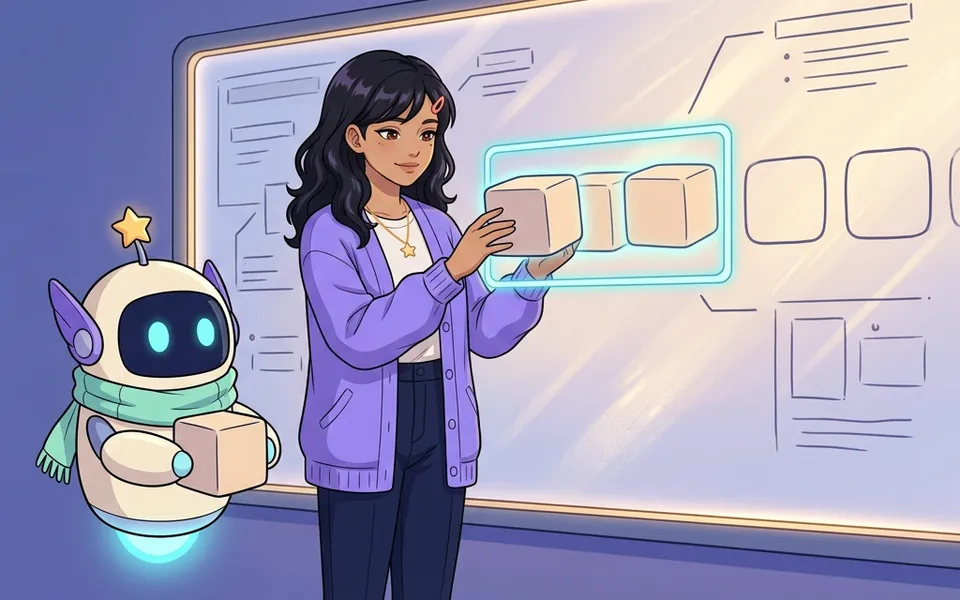

# Study OS

> **Stuck on a lesson because of how it was written — not because the idea is impossible?** Study OS is a live web player that adapts the representation while a deterministic controller keeps curriculum authority.

<p align="center">
  
</p>

**Live product:** [study.design-bakery.com](https://study.design-bakery.com) · UX ship hub: [#126](https://github.com/Pukujan/Study-os/issues/126)

## Why this exists

A learner can fail a step because the author’s **terminology, variable names, notation, or decomposition** got in the way — not because the target concept is out of reach. Generic AI chat often jumps to working answers before the learner can explain, trace, or rebuild the idea alone.

Study OS exists to **reduce extraneous representation friction** while preserving productive difficulty, then fade assistance so the learner is not dependent on simplification.

Concrete example from early use (subject-level, not a population claim): on a dictionaries / Two Sum path, the identifier `seen` conflicted with a prior “set” association; a neutral `box` framing was self-reported as clearer and a later lookup was answered correctly. That episode motivates treating **small representation dimensions** (even one name) as first-class — it does not prove renaming alone caused the improvement.

## What this project is

Study OS is a **web learning player** plus a research harness for representation-aware tutoring.

| Audience | What they get |
| --- | --- |
| New visitors | Guest Start / Resume on live lessons without an account |
| Learners | HESI A2 and DSA lanes with teach → probe steps, companion help, typed step review |
| Collaborators / agents | Deterministic controller contracts, evidence classes, and CI-gated deploys |

It is **not** a generic chatbot tutor, not a “Study OS GPT app” product surface anymore, and not a claim that one learner’s trajectory proves population efficacy.

## What you can make or use

On the live site you can:

- **Start or resume as a guest** — progress attaches to a guest session; claim later if you want a durable identity.
- **Pick a lane** — **HESI A2** (e.g. comparing fractions) and **Algorithms (DSA)** (Big O growth-families first / `catalog_order` 1, then sliding-window and related lessons). The classic DSA PIR path stays available in the stack but is **hidden on home**.
- **Learn in teach, then prove in probe** — teach cards explain; probes check understanding without spoiling answers.
- **Ask for help without losing the step** — **Explain again** and **Worked example** re-render the current step in place.
- **Open the companion / teacher pet** — study-buddy chat (InferHub-backed) sits beside the card.
- **Leave a 1–5 typed review** on a step — required “why” text; self-reported UX feedback, not mastery evidence.

<p align="center">
  
</p>

## How it works

Reader-sized loop:

1. **Course / lesson content** declares steps, knowledge components, and allowed presentations.
2. A **deterministic controller** authorizes the next pedagogical operation (advance, probe, adapt, fade, block).
3. An **AI representation engine** realizes only that authorized op — wording, frames, worked examples — under versioned prompts.
4. The **web player** shows teach vs probe, companion chips, and optional step review.
5. **Durable evidence** keeps observed behavior, self-report, and derived claims separate.

```text
course / lesson
    → deterministic course state
    → controller authorizes one operation
    → AI realizes the representation
    → learner acts in the web player
    → evidence + next state
```

AI may diagnose and generate under constraints. It does **not** silently own curriculum progression or mastery labels.

## Evidence and boundaries

| Claim | Status | Supports | Does not establish |
| --- | --- | --- | --- |
| Live surface is the web player at study.design-bakery.com | shipped | Deploy docs + CD on `main` → gravebuster | Completeness of every planned lane |
| Guest Start/Resume and HESI + DSA player lessons exist | shipped | `web/`, player lessons, home lane tests (tip ~`d9ae5a0`) | All lanes fully stocked |
| Explain again / Worked example keep step identity | shipped | Player + tutor adapt path (#126 / A12) | Universal teaching quality |
| Step reviews are 1–5 + typed why | shipped | `FeedbackBar` + `/api/feedback` | Mastery or learning gains |
| Representation mismatch is the product thesis | shipped (thesis) | Charter / brief / early Two Sum episode | Population efficacy |

**Boundaries:** no population learning-efficacy claims from subject-001 data; self-report ≠ mastery; no fixed “learning styles”; generative media is not canonical algorithm state; private transcripts stay out of the public repo; FOSSIL is optional export, not runtime authority.

Committed player/marketing art lives under `web/public/art/` with provenance in [`.content-system/asset-manifest.json`](.content-system/asset-manifest.json); character refs and prompts are under `.content-system/characters/`.

## Templates and guides

| File | Role |
| --- | --- |
| [`.content-system/`](.content-system/) | Content adapter (brief, brand, visual, assets, rubric) |
| [`docs/HANDOFF.md`](docs/HANDOFF.md) | Current operational handoff |
| [`docs/AUTHORITY.md`](docs/AUTHORITY.md) | Multi-agent arbiter rules |
| [`docs/CURRENT_STATE.md`](docs/CURRENT_STATE.md) | Historical P4 state snapshot (may lag the live web track) |
| [`deploy/README.md`](deploy/README.md) | Gravebuster / Cloudflare deploy |
| [`AGENTS.md`](AGENTS.md) | Agent contract + helper pins |

## Prior work and references

- This README follows scan-first selective bold for product entry; helper pin and writing rules live in `AGENTS.md` / `.content-system/system-version.json` (**0.5.7**).
- Early representation episodes and P4 controller design remain in `docs/` and historical issues (#63 research/runtime track).
- Continuity overlays use PCM (see `AGENTS.md`); content method uses `.content-system/`.

## Try it

**Learners:** open [https://study.design-bakery.com](https://study.design-bakery.com) → Guest start → pick **HESI A2** or **Algorithms (DSA)**.

**Developers:** see [`deploy/README.md`](deploy/README.md). Pushes to `main` run CD on **gravebuster** and publish to study.design-bakery.com. Never commit straight to `main` — branch → PR → squash merge when required CI is green.

### Scan test

Headings + bold anchors should recover: **representation friction** → **web learning player** → **controller authorizes / AI realizes** → **evidence boundaries** → **try the live site**.
