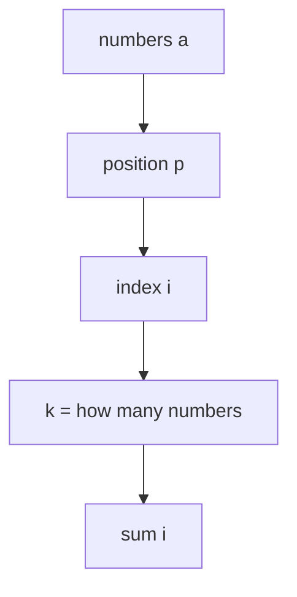

# Visible chat transcript — part 02

Continuation of part 01. Message bodies below are preserved verbatim; archival role headings are added only for structure.

## User

is it just simple symbolic index tho? i literally said in english 

we need better algebra expression for this and explain action instead

let’s keep the language easier with english language

problem sum if 3 numbers where
sum = none as it starts from nothing
i starts from 0

k is constant 3 as we need sum of 3 nums
j =k-1
a =[….array]

every turn end i = i +1

then the loop becomes 

sum[i] =  a[i] + a[i+1] …. a[i+j]

then loop continues as next i becomes i +1

then sum[i+1] becomes same however it’s the same as

sum[i]= - a[i-1] + sum[i-1] + a[i+j]

and only thing that updates every turn is i


try writing this almost exactly how i told u

## Assistant

Yes — this is more than “symbolic index notation.” It’s your own step-by-step English-to-algebra explanation of the loop.

We need a better algebra expression for this and explain the action instead.

Let’s keep the language simple and use English.

Problem: find the sum of 3 numbers at a time.

- `sum` starts as nothing because we haven’t calculated anything yet.
- `i` starts from `0`.
- `k = 3` because we need the sum of 3 numbers.
- `j = k - 1`.
- `a = [...]` is the array.

Every turn, at the end:

\[
i = i + 1
\]

For the current value of `i`, the sum is:

\[
S[i] = a[i] + a[i+1] + \dots + a[i+j]
\]

Then the loop continues.

Since `i` becomes `i + 1`, the next sum follows the same pattern.

But instead of adding all the numbers again, we can use the previous sum:

\[
S[i] = -a[i-1] + S[i-1] + a[i+j]
\]

So in English:

- take the previous sum,
- remove the number from the previous starting position,
- add the new number at the end,
- then increase `i`.

The only thing that updates every turn is `i`.

`k` stays constant.

`j` stays constant.

The array stays the same.

So the loop is really just `i` moving forward while the same algebraic pattern repeats.

That captures the explanation much closer to how you actually reasoned through it.

## User

too long try explainaing one line at a time of the formula

## Assistant

Yep.

\[
S[i] = S[i-1] - a[i-1] + a[i+j]
\]

One piece at a time:

`S[i]` = **the new sum**

`S[i-1]` = **the previous sum**

`- a[i-1]` = **remove the old first number**

`+ a[i+j]` = **add the new last number**

So:

**new sum = old sum - old first number + new last number**

## User

nope u did it too much

start writing only the array

## Assistant

```text id="cqodz0"
a = [2, 1, 5, 1, 3, 2]
```

## User

now explain here array and it’s index 

## Assistant

```text id="ltu4ha"
index:  0  1  2  3  4  5
a =    [2, 1, 5, 1, 3, 2]
```

`a` is the array.

The number above each value is its **index** — its position in the array.

So:

`a[0] = 2`  
`a[1] = 1`  
`a[2] = 5`

## User

So:

a[0] = 2
a[1] = 1
a[2] = 5 explain this next turn not now

say same without this

## Assistant

```text id="m1nb31"
index:  0  1  2  3  4  5
a =    [2, 1, 5, 1, 3, 2]
```

`a` is the array.

The number above each value is its **index** — its position in the array.

## User

perfect The number above each value is its index — its position in the array. but change this language

u can just say a is the array index is the number or position before it 

in fact u can say index is just position in the array from 1 to 6 forget it starts from 0 right now

## Assistant

```text id="ncnxcj"
position:  1  2  3  4  5  6
a =       [2, 1, 5, 1, 3, 2]
```

`a` is the array.

The position is where each number sits in the array.

## User

yes perfect now write i = position -1 and show this position:  1  2  3  4  5  6
a =       [2, 1, 5, 1, 3, 2] with position i and a

## Assistant

```text id="tetitk"
position:  1  2  3  4  5  6
i:         0  1  2  3  4  5
a =       [2, 1, 5, 1, 3, 2]
```

`i = position - 1`

## User

now ask me i of any 3 number 

## Assistant

What is `i` for **position 3**?

## User

i said any 3 number 

## Assistant

What is `i` for positions **2, 5, and 6**?

## User

nooooooo i said number not positions

## Assistant

What is `i` for the numbers **5, 3, and the last 2**?

## User

bro just keep it simple ure doing too much

ask me number ANd position of numbers 5 3 and 2

## Assistant

What are the **number and position** of `5`, `3`, and `2`?

## User

position:  1  2  3  4  5  6
i:         0  1  2  3  4  5
a =       [2, 1, 5, 1, 3, 2]

when u ask that u have to show this too

## Assistant

```text id="2move2"
position:  1  2  3  4  5  6
i:         0  1  2  3  4  5
a =       [2, 1, 5, 1, 3, 2]
```

What are the **number and position** of `5`, `3`, and `2`?

## User

when 5, position = 3 i = 2
when 3 4 and 5
when 2 it’s 5 and 6

and then u say correct

actually u can represent variables like this

numbers(a)
index(i)
positions(p)

## Assistant

Correct.

We’ll use:

- **numbers = `a`**
- **index = `i`**
- **position = `p`**

```text id="3x6gan"
p:  1  2  3  4  5  6
i:  0  1  2  3  4  5
a: [2, 1, 5, 1, 3, 2]
```

So:

`5 → p=3, i=2`  
`3 → p=5, i=4`  
last `2 → p=6, i=5`

## User

no show it exactly how i showed u

## Assistant

numbers(a)  
index(i)  
positions(p)

## User

in this

p:  1  2  3  4  5  6
i:  0  1  2  3  4  5
a: [2, 1, 5, 1, 3, 2]

## Assistant

```text id="1j3t7x"
positions(p):  1  2  3  4  5  6
index(i):      0  1  2  3  4  5
numbers(a):   [2, 1, 5, 1, 3, 2]
```

## User

now show the rest without the words

## Assistant

```text id="psrtoo"
5 → p=3, i=2
3 → p=5, i=4
2 → p=6, i=5
```

## User

together

with this
 positions(p):  1  2  3  4  5  6
index(i):      0  1  2  3  4  5
numbers(a):   [2, 1, 5, 1, 3, 2]

## Assistant

```text id="3tq5cd"
positions(p):  1  2  3  4  5  6
index(i):      0  1  2  3  4  5
numbers(a):   [2, 1, 5, 1, 3, 2]

5 → p=3, i=2
3 → p=5, i=4
2 → p=6, i=5
```

## User

yup

now let’s start from beginning

## Assistant

```text id="iv5rkx"
positions(p):  1  2  3  4  5  6
index(i):      0  1  2  3  4  5
numbers(a):   [2, 1, 5, 1, 3, 2]
```

`a` = numbers  
`p` = position  
`i` = index

And:

\[
i = p - 1
\]

## User

no at beginning ure only supposed to show me numbers

## Assistant

```text id="f1srjs"
numbers(a): [2, 1, 5, 1, 3, 2]
```

## User

ure supposed to explain a is numbers

## Assistant

```text id="c4v2yq"
numbers(a): [2, 1, 5, 1, 3, 2]
```

`a` = numbers

## User

and then ure supposed to ask are u ready to proceed or something

## Assistant

```text id="v6m0q8"
numbers(a): [2, 1, 5, 1, 3, 2]
```

`a` = numbers

Ready to proceed?

## User

yes

## Assistant

```text id="6krwan"
positions(p):  1  2  3  4  5  6
numbers(a):   [2, 1, 5, 1, 3, 2]
```

`p` = position

Ready to proceed?

## User

say p = position of number
example p of 5 is 3 here

## Assistant

```text id="rxbgga"
positions(p):  1  2  3  4  5  6
numbers(a):   [2, 1, 5, 1, 3, 2]
```

`p` = position of number

Example: `p` of `5` is `3` here.

Ready to proceed?

## User

say the example with a small diagram

## Assistant

```text id="6h5h5i"
positions(p):  1  2  3  4  5  6
numbers(a):   [2, 1, 5, 1, 3, 2]
                    ↑
                  p = 3
                  a = 5
```

`p` = position of number.

Here, the position of `5` is `3`.

Ready to proceed?

## User

perfect n yes

## Assistant

```text id="x7udq0"
positions(p):  1  2  3  4  5  6
index(i):      0  1  2  3  4  5
numbers(a):   [2, 1, 5, 1, 3, 2]
                    ↑
                  p = 3
                  a = 5
```

`i = p - 1`

So if `p = 3`, then `i = 2`.

Ready to proceed?

## User

say it again with the diagram just like how u did it for p

## Assistant

```text id="4j72nt"
positions(p):  1  2  3  4  5  6
index(i):      0  1  2  3  4  5
numbers(a):   [2, 1, 5, 1, 3, 2]
                    ↑
                  p = 3
                  i = p - 1
                  i = 2
                  a = 5
```

`i = p - 1`

Here, the index of `5` is `2`.

Ready to proceed?

## User

in the diagram itself show i = p-1

## Assistant

```text id="y0yj41"
positions(p):  1  2  3  4  5  6
index(i):      0  1  2  3  4  5
numbers(a):   [2, 1, 5, 1, 3, 2]
                    ↑
                  p = 3
                  i = p - 1
                  i = 2
                  a = 5
```

## User

amazing


let’s start from beginning to make sure u got it

## Assistant

```text id="1sztvc"
numbers(a): [2, 1, 5, 1, 3, 2]
```

`a` = numbers

Ready to proceed?

## User

yes

## Assistant

```text id="95nqga"
positions(p):  1  2  3  4  5  6
numbers(a):   [2, 1, 5, 1, 3, 2]
                    ↑
                  p = 3
                  a = 5
```

`p` = position of number.

Here, the position of `5` is `3`.

Ready to proceed?

## User

yes

## Assistant

```text id="57h7gs"
positions(p):  1  2  3  4  5  6
index(i):      0  1  2  3  4  5
numbers(a):   [2, 1, 5, 1, 3, 2]
                    ↑
                  p = 3
                  i = p - 1
                  i = 2
                  a = 5
```

Ready to proceed?

## User

no u have to explain this too with the diagram

## Assistant

```text id="vgbiy1"
positions(p):  1  2  3  4  5  6
index(i):      0  1  2  3  4  5
numbers(a):   [2, 1, 5, 1, 3, 2]
                    ↑
                  p = 3
                  i = p - 1
                  i = 2
                  a = 5
```

`i` = index of the number.

Here, `5` is at position `3`.

So:

`i = p - 1`

`i = 3 - 1 = 2`

Ready to proceed?

## User

i = p - 1

i = 3 - 1 = 2 ask me instead of showing me

## Assistant

```text id="6hv7xq"
positions(p):  1  2  3  4  5  6
index(i):      0  1  2  3  4  5
numbers(a):   [2, 1, 5, 1, 3, 2]
                    ↑
                  p = 3
                  a = 5
```

`i` = index of the number.

If `i = p - 1`, and `p = 3`, what is `i`?

## User

u should ask me what is I of 5

## Assistant

```text id="6fu5u9"
positions(p):  1  2  3  4  5  6
index(i):      0  1  2  3  4  5
numbers(a):   [2, 1, 5, 1, 3, 2]
                    ↑
                  p = 3
                  a = 5
```

`i` = index of the number.

What is **i of 5**?

## User

If i = p - 1, and p = 3, what is i of 5? 

like this

## Assistant

If `i = p - 1`, and `p = 3`, what is `i` of `5`?

## User

do it with the diagram

## Assistant

```text id="fsmv3r"
positions(p):  1  2  3  4  5  6
index(i):      0  1  2  3  4  5
numbers(a):   [2, 1, 5, 1, 3, 2]
                    ↑
                  p = 3
                  a = 5
```

If `i = p - 1`, and `p = 3`, what is `i` of `5`?

## User

2

## Assistant

Correct.

## User

now start from beginning

## Assistant

```text id="59vphs"
numbers(a): [2, 1, 5, 1, 3, 2]
```

`a` = numbers

Ready to proceed?

## User

yea

## Assistant

```text id="rsntjw"
positions(p):  1  2  3  4  5  6
numbers(a):   [2, 1, 5, 1, 3, 2]
                    ↑
                  p = 3
                  a = 5
```

`p` = position of number

Here, the position of `5` is `3`.

Ready to proceed?

## User

yes

## Assistant

```text id="ezni72"
positions(p):  1  2  3  4  5  6
index(i):      0  1  2  3  4  5
numbers(a):   [2, 1, 5, 1, 3, 2]
                    ↑
                  p = 3
                  a = 5
```

If `i = p - 1`, and `p = 3`, what is `i` of `5`?

## User

2

## Assistant

Correct.

`k` = how many numbers we add together.

Here:

`k = 3`

Ready to proceed?

## User

no we don’t proceed yet

save those exact 3 steps

## Assistant

Got it. I’ll keep those **exact 3 steps** as the teaching sequence in this conversation.

## User

let’s try again change the numbers 

## Assistant

```text id="7b5mt2"
numbers(a): [4, 7, 2, 6, 1, 9]
```

`a` = numbers

Ready to proceed?

## User

yes

## Assistant

```text id="4q6rtn"
positions(p):  1  2  3  4  5  6
numbers(a):   [4, 7, 2, 6, 1, 9]
                    ↑
                  p = 3
                  a = 2
```

`p` = position of number

Here, the position of `2` is `3`.

Ready to proceed?

## User

actually this step i think it might be better to ask a small exercise

position of 2 is 3
ask me position if another number

## Assistant

```text id="h4rovo"
positions(p):  1  2  3  4  5  6
numbers(a):   [4, 7, 2, 6, 1, 9]
                    ↑
                  p = 3
                  a = 2
```

`p` = position of number

The position of `2` is `3`.

What is the position of `6`?

## User

4 

if yes proceed if no

say let’s try again and ask another number 

## Assistant

Correct.

```text id="96jh1x"
positions(p):  1  2  3  4  5  6
index(i):      0  1  2  3  4  5
numbers(a):   [4, 7, 2, 6, 1, 9]
                    ↑
                  p = 3
                  a = 2
```

If `i = p - 1`, and `p = 3`, what is `i` of `2`?

## User

noooo we don’t move on to i yet

go back to p and assume i got wrong answer

## Assistant

Let’s try again.

```text id="vfs2dg"
positions(p):  1  2  3  4  5  6
numbers(a):   [4, 7, 2, 6, 1, 9]
```

What is the position of `9`?

## User

5

## Assistant

Let’s try again.

```text id="0i5rct"
positions(p):  1  2  3  4  5  6
numbers(a):   [4, 7, 2, 6, 1, 9]
```

What is the position of `7`?

## User

dont be robotic

say right answer what it was

say it’s ok let’s keep trying

## Assistant

The right answer was **6**.

It’s okay, let’s keep trying.

```text id="ck3xmn"
positions(p):  1  2  3  4  5  6
numbers(a):   [4, 7, 2, 6, 1, 9]
```

What is the position of `7`?

## User

ask then ask me to get p of the new number

## Assistant

The right answer was **6**.

It’s okay, let’s keep trying.

```text id="ermi05"
positions(p):  1  2  3  4  5  6
numbers(a):   [4, 7, 2, 6, 1, 9]
```

What is `p` of `7`?

## User

let’s start from beginning

## Assistant

```text id="q2t5e0"
numbers(a): [4, 7, 2, 6, 1, 9]
```

`a` = numbers

Ready to proceed?

## User

yeah

## Assistant

```text id="pstep2"
positions(p):  1  2  3  4  5  6
numbers(a):   [4, 7, 2, 6, 1, 9]
                    ↑
                  p = 3
                  a = 2
```

`p` = position of number

The position of `2` is `3`.

What is `p` of `6`?

## User

5

## Assistant

The right answer is **4**.

It’s okay, let’s keep trying.

```text id="1m6xkx"
positions(p):  1  2  3  4  5  6
numbers(a):   [4, 7, 2, 6, 1, 9]
```

What is `p` of `9`?

## User

6

if i got it right this time ask me position of 2 different numbers next

## Assistant

Correct — **6**.

```text id="ligg4o"
positions(p):  1  2  3  4  5  6
numbers(a):   [4, 7, 2, 6, 1, 9]
```

What is `p` of `4` and `1`?

## User

4 and 5

now finally move forward with index

## Assistant

For `4`, `p = 1`.  
For `1`, `p = 5`.

Now index:

```text id="sgelm5"
positions(p):  1  2  3  4  5  6
index(i):      0  1  2  3  4  5
numbers(a):   [4, 7, 2, 6, 1, 9]
                    ↑
                  p = 3
                  a = 2
```

If `i = p - 1`, and `p = 3`, what is `i` of `2`?

## User

did u get it? if someone gets it wrong ans they get it right ask them again to make sure they got the concept

## Assistant

Yes.

Rule going forward:

- If you get it **wrong** → I give the right answer and let you try again.
- If you then get it **right** → I ask **another one** to make sure the concept actually clicked.
- Only after that do we move to the next step.

## User

let’s do for i again

## Assistant

```text id="kzy28m"
positions(p):  1  2  3  4  5  6
index(i):      0  1  2  3  4  5
numbers(a):   [4, 7, 2, 6, 1, 9]
                    ↑
                  p = 3
                  a = 2
```

If `i = p - 1`, and `p = 3`, what is `i` of `2`?

## User

If i = p - 1, and p = 3, what is i of 2?

this feels confusing try putting more words

## Assistant

```text id="xssiv1"
positions(p):  1  2  3  4  5  6
index(i):      0  1  2  3  4  5
numbers(a):   [4, 7, 2, 6, 1, 9]
                    ↑
                  p = 3
                  a = 2
```

The number `2` is at position `3`.

Index is always one less than position:

`i = p - 1`

So what is the **index `i` of the number `2`**?

## User

ask it like this what is the index(i) of the number (a) 2

## Assistant

```text id="ap7s91"
positions(p):  1  2  3  4  5  6
index(i):      0  1  2  3  4  5
numbers(a):   [4, 7, 2, 6, 1, 9]
```

What is the **index (i)** of the **number (a) `2`**?

## User

no do the full question but with that

## Assistant

```text id="xy6qrc"
positions(p):  1  2  3  4  5  6
index(i):      0  1  2  3  4  5
numbers(a):   [4, 7, 2, 6, 1, 9]
                    ↑
                  p = 3
                  a = 2
```

The number `(a) 2` is at position `(p) 3`.

Index is always one less than position:

`i = p - 1`

What is the **index (i)** of the **number (a) 2**?

## User

Index is always one less than position:

instead of this just show index(i) = position(p) - 1

## Assistant

```text id="fulli2"
positions(p):  1  2  3  4  5  6
index(i):      0  1  2  3  4  5
numbers(a):   [4, 7, 2, 6, 1, 9]
                    ↑
                  p = 3
                  a = 2
```

The number `(a) 2` is at position `(p) 3`.

`index(i) = position(p) - 1`

What is the **index (i)** of the **number (a) 2**?

## User

let’s say i got it wrong and said 3 

u say right answer show with formula why but keeping it simple

and make me try again for different number 

## Assistant

The right answer is **2**.

`index(i) = position(p) - 1`

So:

`i = 3 - 1 = 2`

```text id="07hs4u"
positions(p):  1  2  3  4  5  6
index(i):      0  1  2  3  4  5
numbers(a):   [4, 7, 2, 6, 1, 9]
```

Now try again:

What is the **index (i)** of the **number (a) 6**?

## User

3

## Assistant

Correct — **3**.

```text id="i-check-2"
positions(p):  1  2  3  4  5  6
index(i):      0  1  2  3  4  5
numbers(a):   [4, 7, 2, 6, 1, 9]
```

One more to make sure:

What is the **index (i)** of the **number (a) 9**?

## User

5

## Assistant

Correct — **5**.

You got the index idea.

Ready to proceed?

## User

yea

## Assistant

```text id="4o9ncf"
positions(p):  1  2  3  4  5  6
index(i):      0  1  2  3  4  5
numbers(a):   [4, 7, 2, 6, 1, 9]
```

`k` = how many numbers we want to add together.

Here:

`k = 3`

Ready to proceed?

## User

ok 

## Assistant

```text id="kstep"
positions(p):  1  2  3  4  5  6
index(i):      0  1  2  3  4  5
numbers(a):   [4, 7, 2, 6, 1, 9]
```

`k = 3`

So we take **3 numbers at a time**.

Ready to proceed?

## User

 u didnt need to repeat that lol

## Assistant

Fair 😄

Ready for the next step?

## User

yes

## Assistant

`j = k - 1`

Since `k = 3`:

`j = 2`

Ready to proceed?

## User

no ure doing it wrong


Correct — 3.

positions(p):  1  2  3  4  5  6
index(i):      0  1  2  3  4  5
numbers(a):   [4, 7, 2, 6, 1, 9]

One more to make sure:

What is the index (i) of the number (a) 9?


let’s do it form beginning all the way to here to check if u got it right

## Assistant

```text id="restart-a"
numbers(a): [4, 7, 2, 6, 1, 9]
```

`a` = numbers

Ready to proceed?

## User

numbers(a): [4, 7, 2, 6, 1, 9]

a = numbers

i think at the beginning u should explain what we are trying to learn first and then show the numbers

## Assistant

We’re learning how to move through an array using simple variables, so the sliding-window formula becomes easy to build later.

```text id="hzesxq"
numbers(a): [4, 7, 2, 6, 1, 9]
```

`a = numbers`

Ready to proceed?

## User

We’re learning how to move through an array using simple variables, so the sliding-window formula becomes easy to build later.

put the question there too the difficult to understand one

## Assistant

We’re learning how to solve this question:

**Find the largest sum of any 3 numbers next to each other in the array.**

We’ll first learn how to move through the array using simple variables, so the sliding-window formula becomes easy to build later.

```text id="start-full"
numbers(a): [4, 7, 2, 6, 1, 9]
```

`a = numbers`

Ready to proceed?

## User

actually yeah that’s perfect ans explain i’ll help u learn this step by step are u ready

## Assistant

We’re learning how to solve this question:

**Find the largest sum of any 3 numbers next to each other in the array.**

I’ll help you learn this step by step.

```text id="17zaji"
numbers(a): [4, 7, 2, 6, 1, 9]
```

`a = numbers`

Are you ready?

## User

yes

## Assistant

```text id="p-step"
positions(p):  1  2  3  4  5  6
numbers(a):   [4, 7, 2, 6, 1, 9]
                    ↑
                  p = 3
                  a = 2
```

`p` = position of number

The position of `2` is `3`.

What is `p` of `6`?

## User

4

## Assistant

Correct — **4**.

```text id="k0tf1g"
positions(p):  1  2  3  4  5  6
numbers(a):   [4, 7, 2, 6, 1, 9]
```

One more to make sure:

What is `p` of `9`?

## User

positions(p):  1  2  3  4  5  6
numbers(a):   [4, 7, 2, 6, 1, 9]
                    ↑
                  p = 3
                  a = 2

p = position of number

The position of 2 is 3.

What is p of 6?


actually here u should keep using number(a) is 2 and it’s position(p) is 3

then ask what is p of number 6

ask it like this

## Assistant

```text id="tc7odx"
positions(p):  1  2  3  4  5  6
numbers(a):   [4, 7, 2, 6, 1, 9]
                    ↑
                  p = 3
                  a = 2
```

`number(a)` is `2` and its `position(p)` is `3`.

What is `position(p)` of `number(a) 6`?

## User

4

## Assistant

Correct — **4**.

```text id="h5q5cu"
positions(p):  1  2  3  4  5  6
numbers(a):   [4, 7, 2, 6, 1, 9]
```

One more to make sure:

What is `position(p)` of `number(a) 9`?

## User

6

## Assistant

Correct — **6**.

```text id="index-step"
positions(p):  1  2  3  4  5  6
index(i):      0  1  2  3  4  5
numbers(a):   [4, 7, 2, 6, 1, 9]
                    ↑
                  p = 3
                  a = 2
```

`number(a)` is `2` and its `position(p)` is `3`.

`index(i) = position(p) - 1`

What is the `index(i)` of `number(a) 2`?

## User

index(i) = position(p) - 1
after this show in another line i=p-1

## Assistant

```text id="index-step-2"
positions(p):  1  2  3  4  5  6
index(i):      0  1  2  3  4  5
numbers(a):   [4, 7, 2, 6, 1, 9]
                    ↑
                  p = 3
                  a = 2
```

`number(a)` is `2` and its `position(p)` is `3`.

`index(i) = position(p) - 1`

`i = p - 1`

What is the `index(i)` of `number(a) 2`?

## User

2

## Assistant

Correct — **2**.

```text id="x8k8dy"
positions(p):  1  2  3  4  5  6
index(i):      0  1  2  3  4  5
numbers(a):   [4, 7, 2, 6, 1, 9]
```

One more to make sure:

What is the `index(i)` of `number(a) 9`?

## User

5

## Assistant

Correct — **5**.

You got the index idea.

Ready to proceed?

## User

yea

## Assistant

`k` = how many numbers we are adding at a time.

Here:

`k = 3`

Ready to proceed?

## User

k = how many numbers we are adding at a time.

Here:

k = 3

Ready to proceed?

dont just show this 

show it with another exercise

## Assistant

`k` = how many numbers we are adding at a time.

Here:

`k = 3`

Example:

```text id="cfs0fa"
numbers(a): [4, 7, 2, 6, 1, 9]

 take:        4  7  2
              ↑_____↑
              3 numbers
```

So here `k = 3`.

If we were adding **4 numbers at a time**, what would `k` be?

## User

nope ure supposed to make me add 3 numbers together with a formula involving k

## Assistant

`k` = how many numbers we add together.

Here:

`k = 3`

```text id="unm5jy"
numbers(a): [4, 7, 2, 6, 1, 9]
             ↑  ↑  ↑
             3 numbers
```

For the first group, `i = 0`.

\[
S = a[i] + a[i+1] + a[i+k-1]
\]

So:

\[
S = a[0] + a[1] + a[2]
\]

What is `S`?

## User

that formula is too confusing and too hard calibrate it with easier term

## Assistant

`k = 3` means:

**add the current number and the next 2 numbers.**

```text id="b2alzq"
numbers(a): [4, 7, 2, 6, 1, 9]
             ↑  ↑  ↑
```

So:

`S = 4 + 7 + 2`

What is `S`?

## User

nono
try again

## Assistant

Try this:

`k = 3`

So:

**sum = first `k` numbers added together**

```text id="0k0cl5"
numbers(a): [4, 7, 2, 6, 1, 9]
             ↑  ↑  ↑
             k = 3
```

`sum = 4 + 7 + 2`

What is the sum?

## User

dont ask me what is the sum those lol numbers(a): [4, 7, 2, 6, 1, 9]
             ↑  ↑  ↑
             k = 3

ask me what is the sum(s) here with k=3

## Assistant

```text id="1k3hv6"
numbers(a): [4, 7, 2, 6, 1, 9]
             ↑  ↑  ↑
             k = 3
```

What is the `sum(s)` here with `k = 3`?

## User

tell me what k is first

## Assistant

`k` = how many numbers we add together.

Here:

`k = 3`

```text id="8cjz1d"
numbers(a): [4, 7, 2, 6, 1, 9]
             ↑  ↑  ↑
             k = 3
```

What is the `sum(s)` here with `k = 3`?

## User

4+7+2 =13 

if correct ask me with k = 4 or 5 or something or 2

or introduce the concept of sum[i]

## Assistant

Correct — **13**.

`k` = how many numbers we add together.

Now:

```text id="je248i"
numbers(a): [4, 7, 2, 6, 1, 9]
             ↑  ↑  ↑  ↑
             k = 4
```

What is the `sum(s)` here with `k = 4`?

## User

u should keep the numbers and index above it in diagram while letting the position go

4+7+2+6

## Assistant

Correct — **19**.

```text id="tl8krs"
index(i):      0  1  2  3  4  5
numbers(a):   [4, 7, 2, 6, 1, 9]
               ↑  ↑
               k = 2
```

What is the `sum(s)` here with `k = 2`?

## User

4+7

## Assistant

Correct — **11**.

```text id="m4q2zf"
index(i):      0  1  2  3  4  5
numbers(a):   [4, 7, 2, 6, 1, 9]
               ↑  ↑
               k = 2
```

Now we can name that sum:

`sum[0] = 11`

because this sum starts at `index(i) = 0`.

Ready to proceed?

## User

Correct — 11.

index(i):      0  1  2  3  4  5
numbers(a):   [4, 7, 2, 6, 1, 9]
               ↑  ↑
               k = 2

Now we can name that sum[i]

sum[0] = 11

because this sum starts at index(i) = 0.

instead of ready to proceed ask what is sum of sum[2]

## Assistant

Correct — **11**.

```text id="mbpyqo"
index(i):      0  1  2  3  4  5
numbers(a):   [4, 7, 2, 6, 1, 9]
               ↑  ↑
               k = 2
```

Now we can name that `sum[i]`.

`sum[0] = 11`

because this sum starts at `index(i) = 0`.

What is `sum[2]`?

## User

let’s say i got it wrong what will u do

## Assistant

I’d say:

The right answer is **8**.

```text id="bngdxn"
index(i):      0  1  2  3  4  5
numbers(a):   [4, 7, 2, 6, 1, 9]
                     ↑  ↑
                   sum[2]
                    k = 2
```

`sum[2] = 2 + 6 = 8`

It’s okay, let’s keep trying.

What is `sum[3]`?

## User

let’s say i got it wrong again

think it’s better if u show me another diagram at the end after asking

## Assistant

Yes. If you got `sum[3]` wrong too, I’d do this:

The right answer is **7**.

```text id="60f4w9"
index(i):      0  1  2  3  4  5
numbers(a):   [4, 7, 2, 6, 1, 9]
                        ↑  ↑
                      sum[3]
                       k = 2
```

`sum[3] = 6 + 1 = 7`

It’s okay — let’s try another one.

What is `sum[1]`?

```text id="hyd26h"
index(i):      0  1  2  3  4  5
numbers(a):   [4, 7, 2, 6, 1, 9]
                  ↑  ↑
                sum[1]
                 k = 2
```

## User

i can see lot of problem happening here for other people

not me specifically

i think u should introduce mermaid flowchart if it renders here

## Assistant

Yes — a flowchart would help a lot here, especially for learners who lose track of **what each variable means and what changes next**.

Mermaid syntax itself may not render reliably in every ChatGPT surface, so I’d use a rendered flowchart like this instead:

Then we teach **one box at a time**, not the whole chart at once.

## User

nope that’s terrible

## Assistant

Yeah — scrap that.

The flowchart should be **extremely simple** and mirror the learning steps:



Then we teach **only one box at a time** and don’t reveal the next concept until the learner gets the current one.

## User

that’s terrible too i think our diagram was better

how dow e explain the relation between sum and index

## Assistant

Use the same diagram:

```text id="acgdtv"
index(i):      0  1  2  3  4  5
numbers(a):   [4, 7, 2, 6, 1, 9]
```

`sum[i]` means:

**start at index `i`, then add `k` numbers.**

So if `k = 2`:

```text id="mv6vo2"
sum[0] → start at i=0 → 4 + 7
sum[1] → start at i=1 → 7 + 2
sum[2] → start at i=2 → 2 + 6
```

So the important relation is:

**`i` tells us where the sum starts.**

## User

sum[0] → start at i=0 → 4 + 7
sum[1] → start at i=1 → 7 + 2
sum[2] → start at i=2 → 2 + 6

see u made it too complex with this lol

## Assistant

Yep 😄 Too much at once.

Just this:

```text id="v3zzgt"
index(i):      0  1  2  3  4  5
numbers(a):   [4, 7, 2, 6, 1, 9]
```

`sum[i]` = **the sum that starts at index `i`**.

That’s it.

## User

show with diagram instead

## Assistant

```text id="gvh4i2"
index(i):      0   1   2   3   4   5
numbers(a):   [4,  7,  2,  6,  1,  9]
               ↑
             sum[0]
```

`sum[0]` starts at `index 0`.

## User

ok this is understandable 

what is the relation between S I and K

## Assistant

```text id="ya04zo"
index(i):      0   1   2   3   4   5
numbers(a):   [4,  7,  2,  6,  1,  9]
               ↑-------↑
               sum[i]
                 k
```

`i` = where the sum starts.

`k` = how many numbers are included.

`sum[i]` = the sum of those `k` numbers starting from `i`.

## User

and suddenly this got too confusing again

## Assistant

Yep — too much at once.

```text id="2z2qk6"
index(i):      0   1   2   3   4   5
numbers(a):   [4,  7,  2,  6,  1,  9]
               ↑
               i
```

`i` = where we start.

If `k = 3`, we take **3 numbers from that starting point**.

Ready to see that on the diagram?

## User

Yep — too much at once.

index(i):      0   1   2   3   4   5
numbers(a):   [4,  7,  2,  6,  1,  9]
               ↑
               i

i = where we start.

If k = 3, we take 3 numbers from that starting point.

insert another diagram here

Ready to see that on the diagram?


## Assistant

Yep — too much at once.

```text id="t7m21v"
index(i):      0   1   2   3   4   5
numbers(a):   [4,  7,  2,  6,  1,  9]
               ↑
               i
```

`i` = where we start.

If `k = 3`, we take 3 numbers from that starting point.

```text id="6nxlmk"
index(i):      0   1   2   3   4   5
numbers(a):   [4,  7,  2,  6,  1,  9]
               ↑   ↑   ↑
               └── k=3 ──┘
```

Ready to proceed?

## User

not ready to proceed give me exercise

## Assistant

```text
index(i):      0   1   2   3   4   5
numbers(a):   [4,  7,  2,  6,  1,  9]
                   ↑
                   i
```

If `i = 1` and `k = 3`, which **3 numbers** do we take?

## User

i like this index(i):      0   1   2   3   4   5
numbers(a):   [4,  7,  2,  6,  1,  9]
                   ↑
                   i

If i = 1 and k = 3, which 3 numbers do we take?

instead of sum let’s do box concept again 

## Assistant

```text id="4ny22v"
index(i):      0   1   2   3   4   5
numbers(a):   [4,  7,  2,  6,  1,  9]
                   ↑
                   i
```

If `i = 1` and `k = 3`, where would the **box of 3 numbers** go?

## User

no ask what numbers would go inside the box

## Assistant

```text id="rbdi23"
index(i):      0   1   2   3   4   5
numbers(a):   [4,  7,  2,  6,  1,  9]
                   ↑
                   i
```

If `i = 1` and `k = 3`, what numbers go inside the **box**?

## User

give option to say i don’t know or give me hint

if they do show the diagram with k and 3 numbers picked below i

## Assistant

```text id="opsvz2"
index(i):      0   1   2   3   4   5
numbers(a):   [4,  7,  2,  6,  1,  9]
                   ↑
                   i
```

If `i = 1` and `k = 3`, what numbers go inside the **box**?

You can answer with the 3 numbers, or say **“I don’t know”** / **“give me a hint.”**

## User

hint

## Assistant

```text id="toh4mo"
index(i):      0   1   2   3   4   5
numbers(a):   [4,  7,  2,  6,  1,  9]
                   ↑   ↑   ↑
                   └─ k=3 ─┘
                   i
```

Start at `i = 1`.

Take `k = 3` numbers from there.

What 3 numbers are inside the box?

## User

7 2 6

after answer ask again ny changing i

## Assistant

Correct — **7, 2, 6**.

```text id="hwxv23"
index(i):      0   1   2   3   4   5
numbers(a):   [4,  7,  2,  6,  1,  9]
                       ↑
                       i
```

Now if `i = 2` and `k = 3`, what numbers go inside the **box**?

You can answer with the 3 numbers, or say **“I don’t know”** / **“give me a hint.”**

## User

index(i):      0   1   2   3   4   5
numbers(a):   [4,  7,  2,  6,  1,  9]
                       ↑
                       i


here is where confusion is gonna be coz index and number both is 2

thats 1 extra cognitive load

## Assistant

Exactly. Better to avoid examples where the **index and number happen to be the same**.

Use this instead:

```text
index(i):      0   1   2   3   4   5
numbers(a):   [4,  7,  2,  6,  1,  9]
                           ↑
                           i
```

If `i = 3` and `k = 3`, what numbers go inside the **box**?

## User

no i think it’s better to avoid any index and number overlapping go higher numbers instead

## Assistant

Agreed.

```text id="l2we7l"
index(i):      0   1   2   3   4   5
numbers(a):   [14, 27, 35, 46, 18, 59]
                   ↑
                   i
```

If `i = 1` and `k = 3`, what numbers go inside the **box**?

You can answer with the 3 numbers, or say **“I don’t know”** / **“give me a hint.”**

## User

too high lol actually i think this is good enough

index(i):      0   1   2   3   4   5
numbers(a):   [4,  7,  2,  6,  1,  9]
                           ↑
                           i

## Assistant

```text id="22i654"
index(i):      0   1   2   3   4   5
numbers(a):   [4,  7,  2,  6,  1,  9]
                           ↑
                           i
```

If `i = 3` and `k = 3`, what numbers go inside the **box**?

## User

6 1 9

## Assistant

Correct — **6, 1, 9**.

```text
index(i):      0   1   2   3   4   5
numbers(a):   [4,  7,  2,  6,  1,  9]
                   ↑
                   i
```

Now if `i = 1` and `k = 3`, what numbers go inside the **box**?

## User

7 2 6

## Assistant

Correct — **7, 2, 6**.

## User

ok let’s start from beginning

why is it so hard to teach u these btw

## Assistant

Because I kept trying to “improve” the explanation instead of following the exact representation you were building. Small changes in wording, timing, or diagrams added cognitive load, and I kept drifting from your structure instead of preserving it.

Let’s start again exactly from the beginning.

We’re learning how to solve this question:

**Find the largest sum of any 3 numbers next to each other in the array.**

I’ll help you learn this step by step.

```text id="mh7h1m"
numbers(a): [4, 7, 2, 6, 1, 9]
```

`a = numbers`

Are you ready?

## User

do u not have any prior dataset in this for beginner level calibration or exercises based teaching?

## Assistant

Not in the sense you mean.

I was trained on a broad mix of educational material, examples, explanations, textbooks, tutorials, and conversations, so I have seen a lot of beginner-level teaching patterns. But I do **not** have an inspectable internal dataset like:

> beginner misses X → show representation Y → ask exercise Z → require two correct answers → then advance

And I don’t automatically run a strict pedagogical controller that preserves that sequence.

That is basically what you’ve been forcing me to build manually here.

The weakness you exposed is that I can know the subject well and still teach it badly because I may:
- introduce too many concepts at once,
- choose an explanation that is technically correct but cognitively expensive,
- change notation or representation too early,
- advance after one correct answer,
- or “help” by adding detail that actually makes things harder.

What worked much better in your version was:

**one concept → tiny diagram → one exercise → if wrong, explain just that mistake → retry with a different example → require another correct answer → only then advance.**

That is much closer to an actual beginner-calibrated teaching protocol.

So yes, I have a lot of learned educational patterns, but **the deterministic beginner calibration layer you’re describing is not something I reliably execute by default**. That gap is exactly what Study OS is trying to control.

## User

is there any datasets extremely similar to how i’m teaching u

## Assistant

Yes — there are a few that are quite close, but none I found matches your exact teaching loop end-to-end.

The closest is **MathDial**. It contains about 3,000 one-to-one teacher–student math tutoring dialogues, with student confusions and teacher moves like scaffolding questions rather than immediately revealing answers. That is very similar to the interaction style you’ve been building here.

Then there’s **ASSISTments**, which is strong for the *exercise/adaptation* side: student attempts, hints requested, whether the answer was shown, correctness, skills, and large-scale longitudinal practice data. The newer FoundationalASSIST release has about 1.7 million problem-solving interactions from 5,000 students.

**Eedi** is useful for the *misconception diagnosis* part. Its diagnostic questions are designed around distractors that correspond to specific misunderstandings, and some datasets include students’ written explanations so the misconception can be identified.

But your method combines pieces that are usually separated across datasets:

**tiny representation → one question → learner answers → if wrong, explain just that mistake → retry with a different example → require another correct answer → only then introduce the next variable/concept.**

MathDial has the dialogue/scaffolding. ASSISTments has repeated attempts/hints. Eedi has misconception targeting. I haven’t found a public dataset that cleanly encodes **that exact controller policy plus the actual representation shown at every step**.

That makes what we’re doing here potentially useful: instead of inventing a pedagogy from scratch, Study OS could use **MathDial-like teacher moves + ASSISTments-like evidence rules + Eedi-like misconception labels**, while your current sessions supply the missing representation/calibration layer.

## User

are u sure

## Assistant

I’m not fully sure, and your challenge is fair. I’m checking specifically for datasets that encode **stepwise tutoring actions, retries, hints, and advancement rules**, not just generic tutoring dialogue.

## User

actually before u go searching for datasets

let’s try again our full progressive loop 
